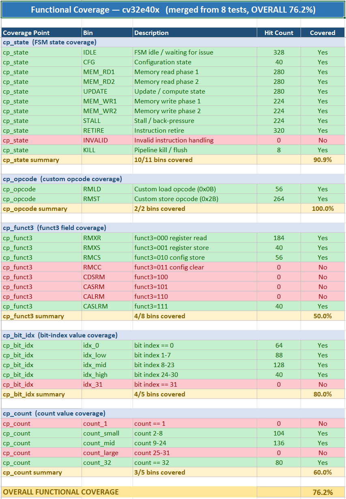
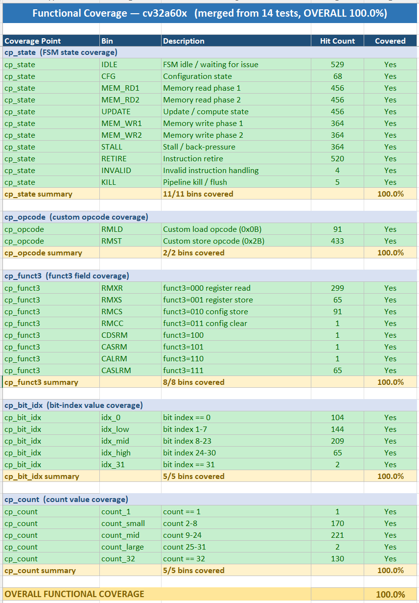
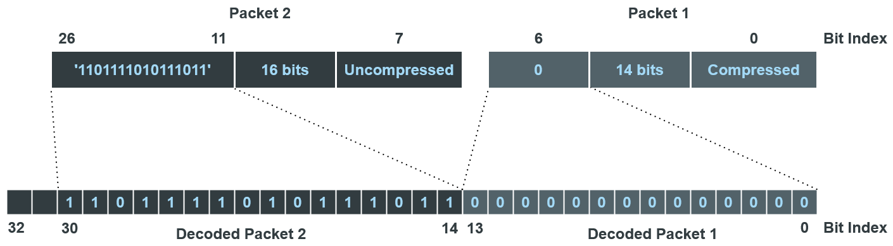

# Tristan — RISC-V Subsystem

Tristan is a self-contained RISC-V SoC built around two cores
(CV32E40X and CVA6 cv32a60x) connected to a custom **Instruction Set
Extension (ISE)** for binary run-length-encoded (BRLE) bit-stream
operations.  The repo ships a cocotb testbench, a minimum-working-example
firmware demonstrating the ISE speed-up, and the vendored peripheral
files needed to simulate standalone.

Interested in this project or want to discuss collaboration? Reach out any time at <office@semify-eda.com>.

## Quick start

After cloning, a one-shot end-to-end run from the repo root:

```bash
git submodule update --init --recursive
pip install -r requirements.txt
export TRISTAN_ROOT=$(pwd)
make firmware    # build minimum-example firmware + dmem image
make             # run the cocotb testbench
```

Expect three `[MMIO]` lines printed by the testbench, one per decoded
16-bit word.  Requires Verilator and a RISC-V GNU toolchain — see
[Setup](#setup) below for versions and install pointers.

## Setup

Fetch the core submodules (CV32E40X and CVA6):

```bash
git submodule update --init --recursive
```

Export the repo root:

```bash
export TRISTAN_ROOT=$(pwd)
```

### Simulation tools

* **Verilator v5.046** — tested version. Other 5.0x releases may work,
  but mismatched versions can yield obscure SystemVerilog or `--timing`
  issues. See https://verilator.org/guide/latest/install.html for the
  build-from-source path.
* **Python 3.12+** — tested with Python 3.13. Earlier 3.x releases are
  unverified.
* **Python packages** — pinned in [`requirements.txt`](requirements.txt):

  ```bash
  pip install -r requirements.txt
  ```

### RISC-V Compiler Toolchain (only for rebuilding the firmware)

The cocotb simulation itself doesn't need the RISC-V toolchain — it loads
the pre-built `firmware.mem` shipped with the repo. The toolchain is only
required if you want to rebuild the firmware (see `## Firmware` below).

```bash
git clone https://github.com/riscv-collab/riscv-gnu-toolchain
cd riscv-gnu-toolchain
sudo ./configure --prefix=/opt/riscv --with-arch=rv32ia
make
```

Add `/opt/riscv/bin` and `/opt/riscv/riscv32-unknown-elf/bin` to your `PATH`.

## Simulation

The top-level cocotb testbench builds and runs with:

    make                        # default: CORE=cv32a60x
    make CORE=cv32e40x          # CV32E40X core variant
    make clean                  # remove sim_build/ and traces

> **First-time note.** The testbench `$readmemh`'s both
> `firmware/firmware.mem` (instruction memory) and
> `firmware/signals/dmem.mem` (data memory). 
> run `make firmware` once before `make` to build the firmware and pack
> `signals/encoded.txt` into `dmem.mem`.

For per-module unit testbenches see `core/custom/<module>/sim/`.

## Firmware

A minimum-working-example firmware lives under [`firmware/`](firmware/).
It decodes three RLE-encoded 16-bit words from DMEM and writes each one
to a Wishbone-mapped sink address (`0x00100000`) — observable on the
external Wishbone bus as three back-to-back write transactions.

### Build

From the repo root:

    make firmware                       # build everything (base + ise + dmem)
    make firmware FW_GOAL=base          # base build only
    make firmware FW_GOAL=ise           # ise build only
    make firmware FW_GOAL=dmem          # dmem image only
    make firmware FW_GOAL=clean         # remove build artefacts

Or `cd firmware && make {base,ise,dmem,clean}` directly — same targets.

Outputs:

    firmware/build/base/firmware.mem    # pure-software variant
    firmware/build/base/firmware.lst    # disassembly
    firmware/build/ise/firmware.mem     # ISE variant
    firmware/build/ise/firmware.lst     # disassembly (shows custom instructions)
    firmware/signals/dmem.mem           # data memory image with encoded stream

### What changes between the base and ise builds

The same `firmware/main/main.c` source is compiled twice. The only difference
between the two builds is whether `-DCUSTOM_EXT` is set on the GCC command
line. Inside `firmware/src/rle.c`, the inner helpers (`extend_value`,
`copy_segment`) have `#ifdef CUSTOM_EXT` branches:

```c
// firmware/src/rle.c — inside extend_value
#ifdef CUSTOM_EXT
    if (value == 1) RMXS(dbit_idx, count_value);   // ISE: one custom instr
    else            RMXR(dbit_idx, count_value);
#else
    uint32_t write = 0x00;                          // base: software loop
    if (value) for (uint8_t i = 0; i < count_value; i++,
                     write = (write << 1) + 1);
    set_stream_bits(dstream, write, dstream->s_bits, count_value);
#endif
```

`RMXS`/`RMXR` (and `RMLD`/`RMCS` used elsewhere) are inline-asm macros
defined in [`firmware/include/instr.h`](firmware/include/instr.h); they
expand to RISC-V custom-opcode `.insn` directives that the Tristan ISE
co-processor executes. The `instr.h` header at the top documents the full
ISE encoding table (R-type opcode `0x0b`, S-type opcode `0x2b`, mnemonics,
operand layouts).

### Encoded data

The signal that the firmware decodes is checked into the repo as
[`firmware/signals/encoded.txt`](firmware/signals/encoded.txt) — one bit
per line.  `make firmware FW_GOAL=dmem` packs it into
`firmware/signals/dmem.mem` via
[`firmware/scripts/generate_dmem.py`](firmware/scripts/generate_dmem.py).
For the BRLE format details, the shipped example values, and the
MSB/LSB-first quirk to be aware of when authoring a replacement, see
[§ Additional Remarks](#additional-remarks) at the end of this file.

## Verification

### Testbench

The top-level cocotb testbench at `core/testbench/top_tb.{sv,py}` instantiates the
full `tristan_soc` (CV32E40X or CVA6 variant, selected by `CORE=`), drives the
two SoC clocks (25 MHz `core_clk`, 100 MHz `wfg_clk`), and lets the firmware
run while a cocotb-driven Wishbone slave answers any peripheral access from
the core. A `wfg_timer_top` is wired in as a real peripheral so that
firmware-issued MMIO writes traverse the OBI → Wishbone bridge end-to-end.

Three module-level cocotb testbenches cover the custom blocks in isolation:

| Module                 | Directory                            |
|------------------------|--------------------------------------|
| ISE (shifter)          | `core/custom/ise/sim/`               |
| OBI ↔ Wishbone bridge  | `core/custom/obi_wb_bridge/sim/`     |
| Wishbone RAM interface | `core/custom/wb_ram_interface/sim/`  |

Each is invoked the same way as the top-level:

    cd core/custom/<module>/sim
    make
    make clean

### Test results

All bundled testbenches (top-level + the three module sims) pass on
Verilator 5.046 with the default `CORE=cv32a60x` configuration.

### Larger verification & demo framework

The benchmark and functional-coverage data shown below come from
semify's **SmartWave** framework — an FPGA-based waveform-generator
and protocol-analyzer product that integrates this RISC-V SoC. There,
the firmware decompresses RLE-encoded signal data via the ISE shown
in this repo and feeds it through an on-chip waveform-generation
pipeline driving the device's analog/digital pins. Verification is
exercised end-to-end both in cocotb simulation and on real hardware;
the numbers and coverage images below are reproduced from those runs
and are not collected by the minimum example shipped here.

### Benchmark

The workload is an RLE-decompression loop running on a 16-sample sine
signal: the firmware decodes a stream of compressed sine samples,
drives them through the waveform pipeline, and measures decode
throughput on hardware. Two firmware variants are compared — a pure
software implementation (baseline) and one that uses the custom ISE
instructions for the bit-packing inner loops.

Hardware-measured on a Xilinx FPGA (100 MHz peripheral clock,
25 MHz CV32A60X SoC clock, 2026-05-07):

| Metric                                      | Result                       |
|---------------------------------------------|------------------------------|
| Decompression throughput (ISE vs software)  | ~2.0×                        |
| Decode firmware `.text` size (ISE)          | ~64 % of software (~36 % smaller) |
| Compression ratio (raw / encoded)           | 2.3× on this signal          |

### Functional coverage

Functional coverage was collected from the same framework described
above. The images below are exported directly from those runs.





*Coverage focussed on the cv32a60x core; not all tests are written for
the cv32e40x core as well.*

## Additional Remarks

### BRLE encoding

The compression scheme used here is **Binary Run-Length Encoding (BRLE)**.
The encoded stream is a sequence of variable-length blocks; each block
starts with a 1-bit marker (`0` = literal copy, `1` = run-length
compressed), followed by a 5-bit count field encoding (N − 1), and then
either N raw bits (literal) or a single value bit repeated N times
(compressed).



### Example data and what a new `encoded.txt` must satisfy

The shipped [`firmware/signals/encoded.txt`](firmware/signals/encoded.txt)
encodes three 16-bit values:

| Word | Value  | Binary (MSB-first) |
|------|--------|--------------------|
| 1    | 0x00FF | `0000_0000_1111_1111` |
| 2    | 0xAAAA | `1010_1010_1010_1010` |
| 3    | 0x8000 | `1000_0000_0000_0000` |

To exercise different data, replace `encoded.txt` and rebuild the dmem
image with `make firmware FW_GOAL=dmem`. The firmware always reads the
first three 16-bit decoded words and emits them to the Wishbone sink at
`0x00100000`, so encode at least 48 decoded bits' worth of data.

Format rules:

- **One bit per line.** Each line is a literal `0` or `1`.
- **Bit-stream layout follows the BRLE format** (1-bit compress flag,
  5-bit count − 1, then either 1 value bit or N raw bits — see the BRLE
  reference above).

**MSB-first / LSB-first quirk.** The decoder stores bits **LSB-first
within a byte**: decoded bit 0 lands in the LSB of `decoded_buf[0]`,
bit 7 in the MSB, bit 8 in the LSB of `decoded_buf[1]`, and so on.
So if you want `decoded_buf[2] = 0xAA` (which a human reads MSB-on-left
as `10101010`), your decoded bit stream at positions 16..23 must be
**`0, 1, 0, 1, 0, 1, 0, 1`** (LSB first, so the LSB is the first emitted
bit). The firmware's `main.c` packs two consecutive bytes into a 16-bit
word as `(buf[0] << 8) | buf[1]`, which undoes the visual surprise — the
hex value you see on the Wishbone bus is the natural human-readable form
of the 16-bit number you encoded.

### Vendored files (under `vendor/`)

A few SystemVerilog files are vendored from the upstream `wfg-fpga`
project into [`vendor/wfg/`](vendor/wfg/) so this repo simulates
standalone, without a sibling checkout:

| Vendored file | Purpose |
|---|---|
| `design/pkg/wfg_pkg.sv` | Slimmed Wishbone-bus parameter package |
| `design/wfg/wfg_timer/rtl/*.sv` | A Wishbone peripheral the testbench instantiates so the firmware has something to talk to |
| `design/semify_common/wishbone/arbiter/rtl/wb_arbiter_2.sv` | Wishbone master arbiter used by the OBI ↔ WB bridge unit sim |

The build's `WFG_ROOT` Make variable defaults to `$(TRISTAN_ROOT)/vendor/wfg`.
If you have the upstream project checked out alongside this one, set
`WFG_ROOT` to its path before running `make` and the vendored copies
are overridden.

---

For questions, contributions, or collaboration interest, contact us any time at <office@semify-eda.com>.
